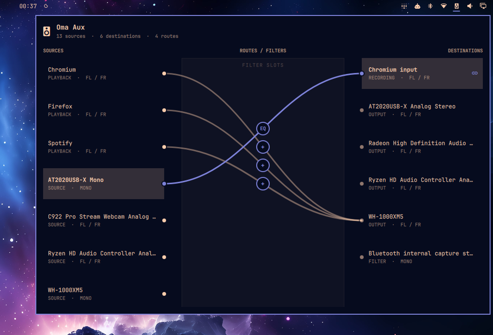

# Oma Aux

Oma Aux is a PipeWire patchbay for the Omarchy bar. It exposes application
playback, microphones, sink monitors, recording applications, hardware outputs,
and filter nodes as a visual routing graph.

Drag from a source socket to a destination, or select a source and click any
number of destinations. Oma Aux shows every route at once and connects matching
channel names such as `FL` and `FR`, with fallbacks for mono and unnamed ports.
Selecting an active destination removes only that route. Select the marker in
the center routing lane to insert a per-route stereo processor with balance and
five-band equalization. Balance can place a source in the left or right ear;
the EQ provides ±12 dB at 100 Hz, 250 Hz, 1 kHz, 4 kHz, and 10 kHz.

Playback is grouped by application, not browser tab: `application.id`, then
`application.process.binary`, then `application.name`. All matching playback
streams share one filter per destination, with channels mapped separately for
each stream. Saved application filters reconnect after pause/resume even when
node IDs, serials, or stream names change. This is generic, including Firefox
and Chromium; separate tabs, windows, or instances with the same identity cannot
have independent settings. Identity changes require reselection. Hardware keeps
its node-name identity; unidentified streams stay separate and are not restored
across stream/server recreation. Anonymous streams without serials or a known
local server lifetime cannot be reliably restored across helper invocations.

## Preview




## Requirements

- Omarchy Shell
- PipeWire
- `pw-dump`
- `pw-link`
- Python 3.10 or newer

These are present on a standard Omarchy installation.

## Installation

```bash
omarchy plugin add https://github.com/sam0110/oma-aux.git --enable
```

## Removal

```bash
omarchy plugin remove sam0110.oma-aux
```

## Current Scope

- Live node, port, and link discovery
- Audio-only filtering
- Sink monitor routing
- Stereo-aware node connections
- Visual routes with many-to-one and one-to-many routing
- Connect and disconnect from the bar panel
- Per-route left/right balance
- Per-route five-band stereo EQ

Oma Aux inserts an owned PipeWire filter-chain node for each processed route.
Filter settings are stored in `$XDG_STATE_HOME/oma-aux/routes.json` (normally
`~/.local/state/oma-aux/routes.json`) and are restored when the graph watcher
starts. Editing an existing filter updates its controls in place. Removing
filters resets the processor to a neutral bypass but keeps its PipeWire nodes
and links stable; the processor is retired when the route itself is
disconnected. This avoids forcing playback applications to reconnect.
The watcher stays active while the panel is closed and retries transient graph
changes. Plain direct links are not saved; add a filter (including neutral
bypass) for automatic application-route restoration.

## Command-Line Helper

The bundled helper can also inspect or change the graph directly:

```bash
bin/oma-aux snapshot
bin/oma-aux watch
bin/oma-aux toggle OUTPUT_NODE INPUT_NODE
bin/oma-aux connect OUTPUT_NODE INPUT_NODE
bin/oma-aux disconnect OUTPUT_NODE INPUT_NODE
bin/oma-aux filter-set OUTPUT_NODE INPUT_NODE '{"pan":0,"eq":[0,0,0,0,0]}'
bin/oma-aux filter-clear OUTPUT_NODE INPUT_NODE
```

Endpoint keys from `snapshot` can replace numeric node IDs (the panel uses
keys). Any current member ID selects its entire playback application group.
