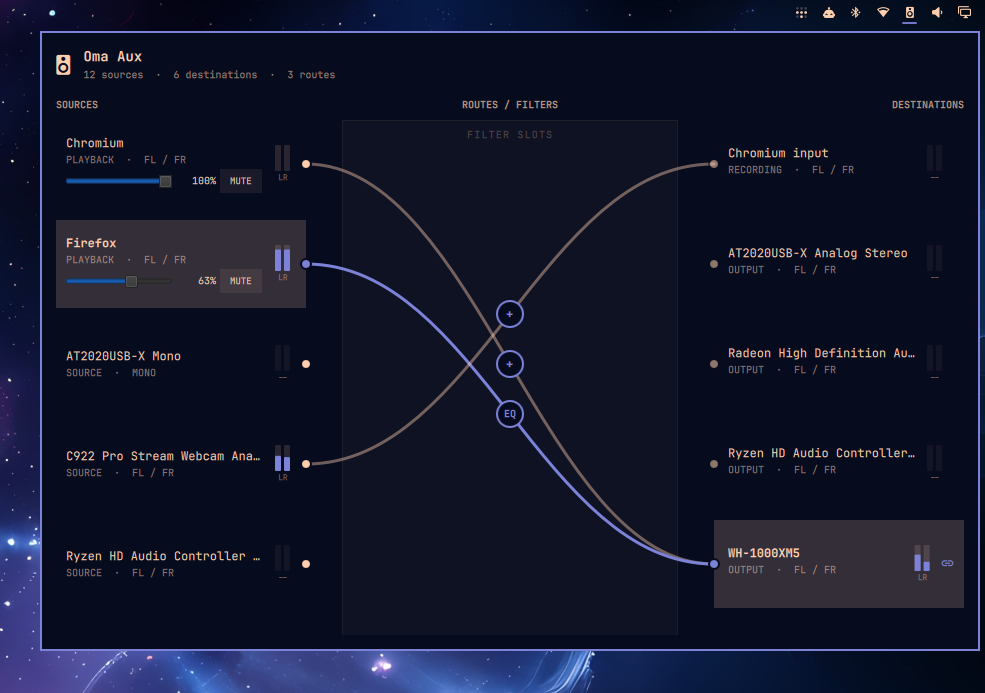
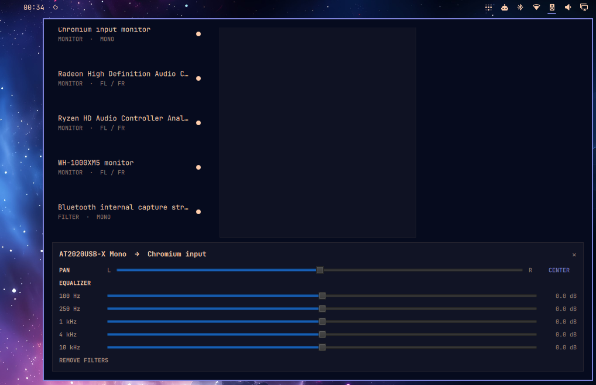

# Oma Aux

Oma Aux is a PipeWire patchbay for the Omarchy bar. It exposes application
playback, microphones, sink monitors, recording applications, hardware outputs,
and filter nodes as a visual routing graph.

Drag from a source socket to a destination, or select a source and click any
number of destinations. Oma Aux shows every route at once and connects matching
channel names such as `FL` and `FR`, with fallbacks for mono and unnamed ports.
Selecting an active destination removes only that route. Select the marker in
the center routing lane to insert a per-route stereo processor with balance and
five-band equalization. Balance can place a source in the left or right ear;
the EQ provides ±12 dB at 100 Hz, 250 Hz, 1 kHz, 4 kHz, and 10 kHz.

Playback is grouped by application, not browser tab: `application.id`, then
`application.process.binary`, then `application.name`. All matching playback
streams share one filter per destination, with channels mapped separately for
each stream. Saved application filters reconnect after pause/resume even when
node IDs, serials, or stream names change. This is generic, including Firefox
and Chromium; separate tabs, windows, or instances with the same identity cannot
have independent settings. Identity changes require reselection. Hardware keeps
its node-name identity; unidentified streams stay separate and are not restored
across stream/server recreation. Anonymous streams without serials or a known
local server lifetime cannot be reliably restored across helper invocations.

Each identified playback application has one 0-100% volume slider and mute
button affecting every member stream, independently of route EQ/pan. Mute does
not change volume, and moving the slider does not unmute. Volume uses the usual
cubic scale; a group shows its highest channel volume, with `*` for differing
volumes and `MIXED` for differing mute states. Clicking `MIXED` mutes all members.
Unsupported or unidentified streams have no app controls. External changes are
shown on the watcher's roughly two-second refresh, not continuously overridden.
Only settings explicitly changed in Oma Aux are saved, under `apps` alongside
the existing route records in `routes.json`. They apply to new/recreated member
streams even with the panel closed; restarting the watcher leaves already
handled live streams alone. Hardware volume, defaults, and route filters are
untouched. Slider updates are coalesced at 120 ms intervals.

## Preview





## Requirements

- Omarchy Shell
- PipeWire
- `pw-dump`
- `pw-link`
- `pw-cli` (application volume/mute and route filters)
- `pw-record` (optional live meters; raw float capture support) and WirePlumber
- Python 3.10 or newer

These are present on a standard Omarchy installation.

## Installation

```bash
omarchy plugin add https://github.com/sam0110/oma-aux.git --enable
```

## Removal

```bash
omarchy plugin remove sam0110.oma-aux
```

## Current Scope

Stereo PCM peak meters run only while the panel is open, independently of the
always-on route watcher. Left/right bars use a -60 to 0 dBFS scale (red at
clipping); `--` means unavailable, not silence. Application groups show the
maximum of each channel across all members, not their sum. Outputs measure
their sink monitor mix, not an estimate from incoming routes. PipeWire performs
stereo conversion for mono/multichannel nodes; these are sample peaks, not true
peak or loudness measurements. Recording/filter endpoints without supported
monitoring show `--`.

Monitoring uses at most 16 `pw-record` children, shared by sink and monitor rows,
with 10 Hz numeric-only UI updates and one-second graph discovery. Groups that
do not fit the cap are unavailable. Passive, serial-targeted capture links do
not change defaults or existing routes and have no playback/loopback path.
Suspended nodes may be unavailable; capture failures retry after five seconds.
Captures are removed on panel close, helper exit, or target disappearance.

- Live node, port, and link discovery
- Audio-only filtering
- Sink monitor routing
- Stereo-aware node connections
- Visual routes with many-to-one and one-to-many routing
- Connect and disconnect from the bar panel
- Per-route left/right balance
- Per-route five-band stereo EQ

Oma Aux inserts an owned PipeWire filter-chain node for each processed route.
Filter settings are stored in `$XDG_STATE_HOME/oma-aux/routes.json` (normally
`~/.local/state/oma-aux/routes.json`) and are restored when the graph watcher
starts. Editing an existing filter updates its controls in place. Removing
filters resets the processor to a neutral bypass but keeps its PipeWire nodes
and links stable; the processor is retired when the route itself is
disconnected. This avoids forcing playback applications to reconnect.
The watcher stays active while the panel is closed and retries transient graph
changes. Plain direct links are not saved; add a filter (including neutral
bypass) for automatic application-route restoration.

## Command-Line Helper

The bundled helper can also inspect or change the graph directly:

```bash
bin/oma-aux snapshot
bin/oma-aux watch
bin/oma-aux meters  # Read-only peak JSON; Ctrl-C stops all captures
bin/oma-aux toggle OUTPUT_NODE INPUT_NODE
bin/oma-aux connect OUTPUT_NODE INPUT_NODE
bin/oma-aux disconnect OUTPUT_NODE INPUT_NODE
bin/oma-aux filter-set OUTPUT_NODE INPUT_NODE '{"pan":0,"eq":[0,0,0,0,0]}'
bin/oma-aux filter-clear OUTPUT_NODE INPUT_NODE
bin/oma-aux app-set 'app:application.process.binary:firefox:out' '{"volume":65}'
bin/oma-aux app-set 'app:application.process.binary:firefox:out' '{"mute":true}'
```

Endpoint keys from `snapshot` can replace numeric node IDs (the panel uses
keys). Any current member ID selects its entire playback application group.
